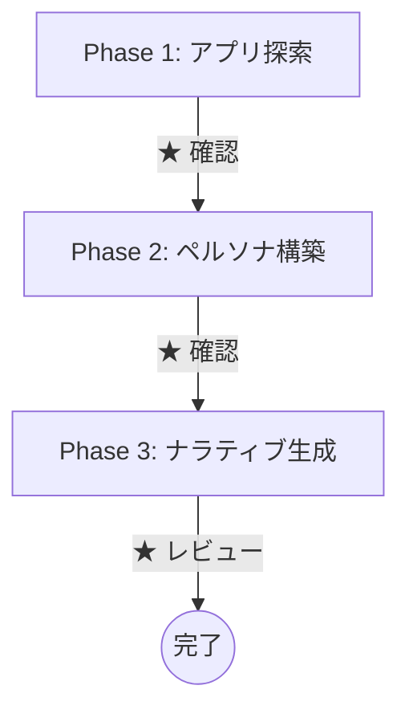

# ui-narrative-probe

[English](./README.md)

UIから多様なペルソナのナラティブを生成し、意図したユースケースの実現を検証する Claude Code プラグイン。

## コンセプト

**開発者が意図したユースケースは、UIを通じてユーザーに伝わっているか？**

UIからユーザーが認知できる情報のみを入力として、多様なペルソナを構築し、ペルソナ自身がアプリを使うナラティブを語る。多角的な視点で見たとき、意図通りにいかない場面があれば、それが改善の契機になる。

- **ユーザー体験由来の情報のみ** — DOMや実装詳細ではなく、ユーザーが認知できる情報だけで思考する
- **ペルソナそのものとして語る** — ペルソナについて書くのではなく、ペルソナ自身が行動を紡ぐ
- **アプリの目的から人を導く** — 目的を達成したい人を考える。どんなユーザーを作るべきかを恣意的に決めない
- **gaps.mdは結果** — ペルソナが壁にぶつかった場面の記録。最初から狙うものではない

## インストール

Claude Code で以下を実行する:

```
/plugin marketplace add two-pack/ui-narrative-probe
/plugin install ui-narrative-probe@ui-narrative-probe
/reload-plugins
```

## 使い方

対象アプリを起動した状態で、以下のコマンドを実行する:

```
/ui-narrative-probe:run <対象アプリのURL> [言語]
```

例:

```
/ui-narrative-probe:run http://localhost:3000 ja
/ui-narrative-probe:run http://localhost:3000 en
```

`言語` 引数で全成果物の出力言語を指定する。省略時は日本語。

### フロー



各Phaseの間で人間の確認（★）が入る。探索結果やペルソナの承認・調整を行いながら進める。

### 前提条件

- [Claude Code](https://docs.anthropic.com/en/docs/claude-code) がインストール済みであること
- ブラウジングツール（playwright-cli等）が使用可能であること
- 対象アプリが起動中であること

## 成果物

`.ui-narrative-probe/` ディレクトリに以下が生成される:

| ファイル | 内容 |
|---------|------|
| `app-understanding.md` | UIからユーザーが認知できるもの |
| `personas.md` | UIから導出されたペルソナ |
| `narratives/*.md` | ペルソナ自身が語るナラティブ |
| `gaps.md` | ペルソナが壁にぶつかった場面の記録（改善示唆） |

## ライセンス

MIT
