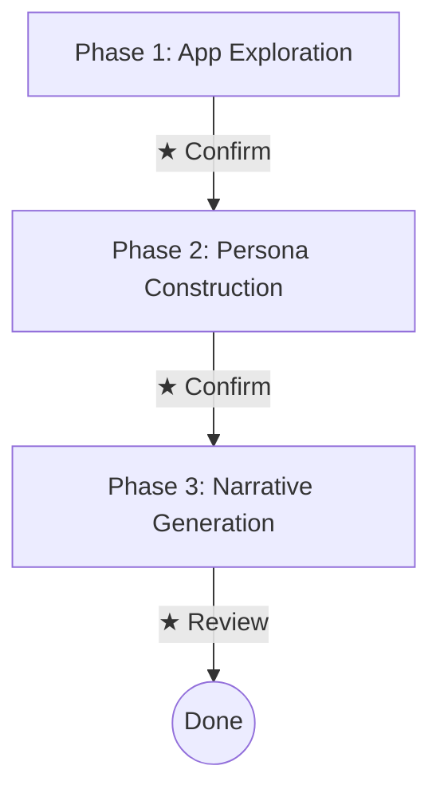

# ui-narrative-probe

[日本語](./README.ja.md)

A Claude Code plugin that generates diverse persona narratives from UI to verify whether intended use cases are realized.

## Concept

**Are the use cases developers intended being communicated to users through the UI?**

Using only information perceivable by users from the UI, this plugin constructs diverse personas and has each persona tell their own narrative of using the app. When viewed from multiple perspectives, scenes where things don't go as intended become opportunities for improvement.

- **User-experience-derived information only** — Think using only what users can perceive, not DOM or implementation details
- **Be the persona** — Not writing about a persona, but the persona themselves weaving their actions
- **Derive people from app purpose** — Think about who wants to achieve the purpose. Don't arbitrarily decide what kind of users to create
- **gaps.md is a result** — A record of scenes where personas hit walls. Not a goal to aim for

## Installation

Run the following in Claude Code:

```
/plugin marketplace add two-pack/ui-narrative-probe
/plugin install ui-narrative-probe@ui-narrative-probe
/reload-plugins
```

## Usage

With the target app running, execute:

```
/ui-narrative-probe:run <target app URL> [language]
```

Examples:

```
/ui-narrative-probe:run http://localhost:3000 en
/ui-narrative-probe:run http://localhost:3000 ja
```

The `language` argument controls the output language of all artifacts. If omitted, defaults to Japanese.

### Flow



Human checkpoints (★) are inserted between each phase. Approve and adjust exploration results and personas as you go.

### Prerequisites

- [Claude Code](https://docs.anthropic.com/en/docs/claude-code) is installed
- A browsing tool (playwright-cli, etc.) is available
- The target app is running

## Artifacts

Generated in the `.ui-narrative-probe/` directory:

| File | Content |
|------|---------|
| `app-understanding.md` | What users can perceive from the UI |
| `personas.md` | Personas derived from the UI |
| `narratives/*.md` | Narratives told by personas themselves |
| `gaps.md` | Records of scenes where personas hit walls (improvement suggestions) |

## License

MIT
