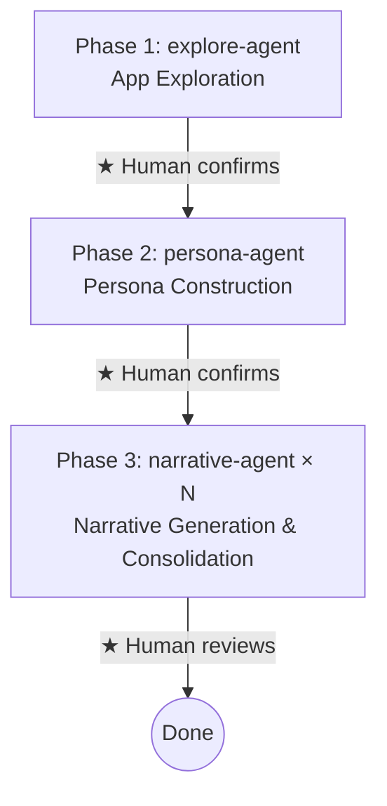

# run command

Orchestrator that generates diverse persona narratives from UI and verifies whether intended use cases are realized.

## Usage

```
/ui-narrative-probe:run <app_url> [language]
```

## Arguments

- 1st argument: Target app URL
- 2nd argument (optional): Output language (e.g., `ja`, `en`, `zh`). All artifacts are generated in this language. When launching agents via Agent tool, include this language in the prompt. If omitted, default to Japanese.

## Prerequisites

- A browsing tool (playwright-cli, etc.) must be available
- The target app must be running

## Flow



## Execution Instructions

### Phase 1: App Exploration

Launch `ui-narrative-probe:explore-agent` via **Agent tool**. Pass the target app URL.

After completion, present a summary of `app-understanding.md` to the user and get approval before proceeding.

### Phase 2: Persona Construction

Follow `ui-narrative-probe:persona-agent` instructions and execute **in the main conversation**.

Get user approval before proceeding.

### Phase 3: Narrative Generation

Launch `ui-narrative-probe:narrative-agent` via **Agent tool in parallel** for each persona.

Input to pass to each agent:
- `.ui-narrative-probe/app-understanding.md`
- The relevant persona definition (from `personas.md`)
- Other personas' definitions (the rest of `personas.md`)

After all agents complete, **in the main conversation**, read all narratives and identify/consolidate cross-persona interactions (skip if the app is single-user).

Present the narrative list and gaps.md to the user for review.

## Artifacts

```
.ui-narrative-probe/
├── app-understanding.md              # Phase 1
├── screenshots/                      # Phase 1
├── personas.md                       # Phase 2
├── gaps.md                           # Phase 3 (improvement suggestions)
└── narratives/
    ├── {persona1}.md                 # Phase 3
    └── {persona2}.md                 # Phase 3
```
